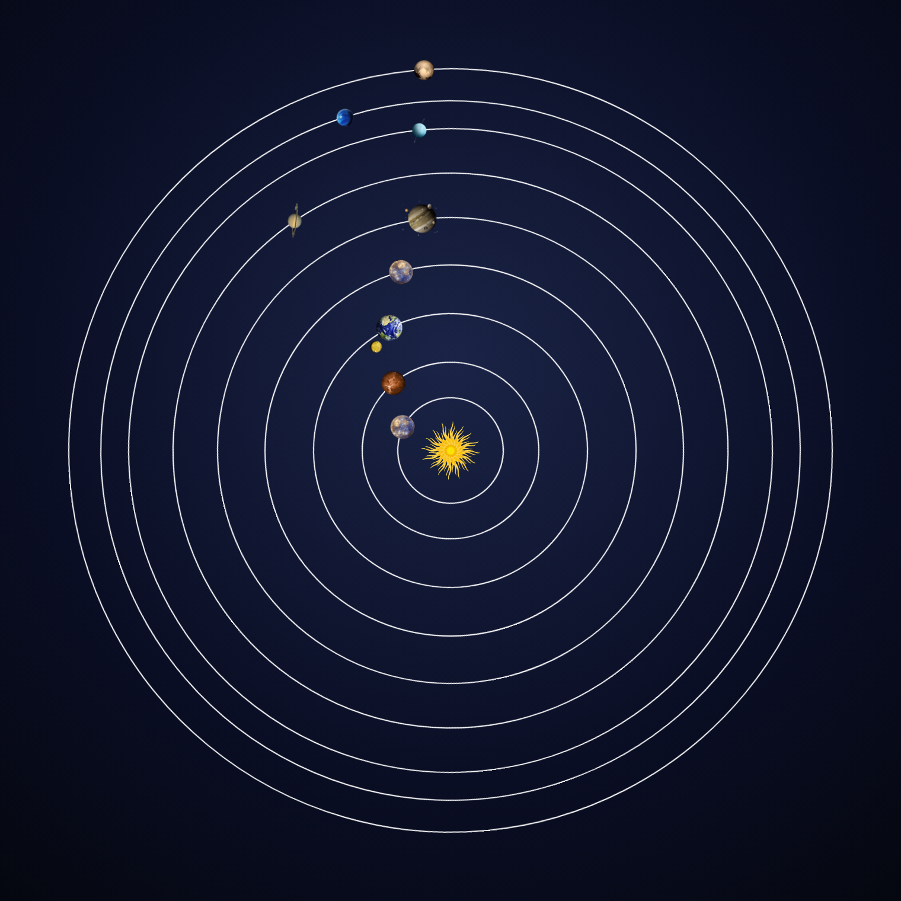

# 🪐 Planets Orbiting the Sun ｜行星繞日動畫

> 純 CSS 打造的太陽系公轉動畫 — 沒有一行 JavaScript，全靠 CSS Keyframes 與座標數學驅動九大行星（含冥王星）以各自週期繞日運行。

<p align="center">
  
</p>

<p align="center">
  <a href="https://edithfxx.github.io/planets-orbiting-the-sun/"><b>🔗 Live Demo（點我看動畫）</b></a>
</p>

<p align="center">
  
  
  
  
</p>

---

## 📖 專案簡介

這是一個以 **CSS 動畫** 為核心的視覺練習作品。目標是在 **完全不使用 JavaScript** 的前提下，重現太陽系中各行星以不同半徑、不同週期繞行太陽的畫面，並且讓地球在公轉的同時帶著月球一起運行。

專案重點不在「畫得多華麗」，而在於展示我對 **CSS 排版定位、變形（transform）、關鍵影格動畫，以及可維護樣式結構** 的掌握度。

---

## ✨ 功能特色

- **🌞 九大天體同框公轉**：水星、金星、地球、火星、木星、土星、天王星、海王星、冥王星，各自沿獨立軌道運行。
- **🌍 巢狀動畫（地月系統）**：月球是地球的子元素，地球繞日的同時，月球再繞地球運行，形成雙層動畫。
- **⏱️ 差異化公轉週期**：每條軌道有各自的 `animation-duration`，可自由設定各行星的快慢，模擬速度差。
- **🚀 進場動畫**：載入時整個太陽系會由縮放＋旋轉的狀態展開，作為第一印象的視覺亮點。
- **📐 以數學推算的軌道間距**：每條軌道半徑都是由「上一顆行星位置 + 星球尺寸 + 軌道間隔」逐層計算而來（見下方技術細節）。
- **⚡ 零 JavaScript、零框架**：純 HTML + CSS，載入輕量、無執行期成本。

---

## 🛠️ 技術棧

| 類別 | 使用技術 |
| --- | --- |
| 標記 | HTML5（語意化容器結構） |
| 樣式 | CSS3、Sass/SCSS（附 `.map` sourcemap） |
| 動畫 | CSS `@keyframes`、`transform`、`animation` |
| 部署 | GitHub Pages |

---

## 🧠 技術亮點（Technical Highlights）

這一節是給檢視程式碼的工程師 / 面試官看的，說明幾個我在實作時刻意做的決策。

### 1. 用「絕對定位 + `translate(-50%, -50%)`」建立同心圓座標系
所有軌道與太陽都以 `top:0; left:0` 對齊到 `.solar-system` 的原點，再用 `transform: translate(-50%, -50%)` 把自己的中心點拉回原點。如此一來，不論軌道多大，圓心永遠重合，天然形成一組同心圓，不需逐一計算 margin。

### 2. 單一 Keyframe 重用 ＋ 以 `animation-duration` 控制速度
公轉只寫了**一組** `orbit-animation`（旋轉 360°），所有軌道共用；每顆行星的「速度差」則透過各自覆寫 `animation-duration` 來達成。動畫邏輯與速度參數分離，未來要新增行星或調速，只改一個數字即可。

```css
.orbit            { animation: orbit-animation 2s infinite linear; }
.orbit-mercury    { animation-duration: 5s; }
.orbit-neptune    { animation-duration: 20s; }
.orbit-pluto      { animation-duration: 70s; }

@keyframes orbit-animation {
  100% { transform: translate(-50%, -50%) rotate(-360deg); }
}
```

### 3. 可推導的軌道半徑
每條軌道寬度不是隨手填的數字，而是依「前一顆行星的距離 + 兩顆星球半徑 + 軌道間隔」累加得出，並在原始碼中以註解記錄推導過程，讓後續維護者能看懂尺寸的來由，而非魔法數字。

### 4. 巢狀公轉（地球 → 月球）
利用 DOM 的父子關係讓動畫自然疊加：地球套用繞日動畫，月球作為地球子節點再套用繞地動畫，不需任何 JS 座標計算即完成雙層軌道。

### 5. 效能取向
動畫只操作 `transform`（GPU 加速、不觸發 reflow），並以 `linear` timing 維持等速旋轉，兼顧順暢與低耗能。

---

## 📂 專案結構

```
planets-orbiting-the-sun/
├── index.html                  # 天體 DOM 結構
├── css/
│   ├── v2-solar-system.css     # 版面、定位、軌道尺寸
│   └── v2-animation.css        # keyframes 與各軌道動畫參數
└── img/                        # 行星／太陽／背景素材
    └── screenshot.png          # README 預覽圖
```

樣式刻意拆成兩支：**結構／版面** 與 **動畫** 各自獨立，關注點分離、方便單獨調整。

---

## ▶️ 本機執行

不需任何建置流程或套件安裝，直接開啟即可：

```bash
git clone https://github.com/edithfxx/planets-orbiting-the-sun.git
cd planets-orbiting-the-sun

# 直接用瀏覽器打開 index.html，或起一個簡易伺服器：
npx serve .
```

---

> 這個作品用來展示我在 **純 CSS 動畫、版面定位與樣式結構設計** 上的能力。歡迎點開 [Live Demo](https://edithfxx.github.io/planets-orbiting-the-sun/) 看實際運行效果。
